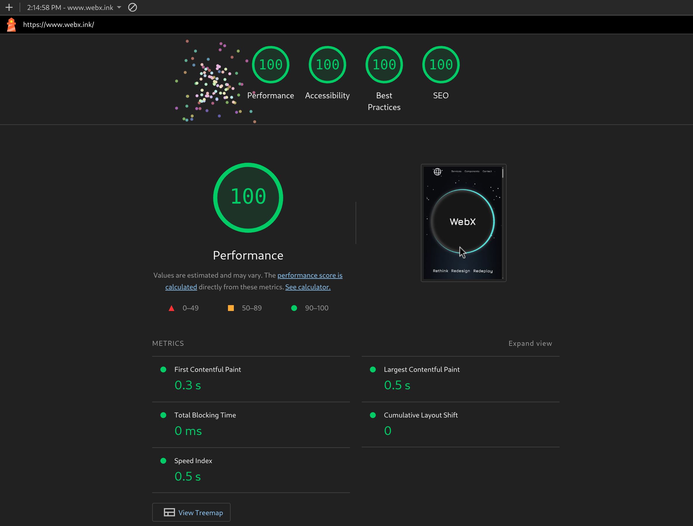
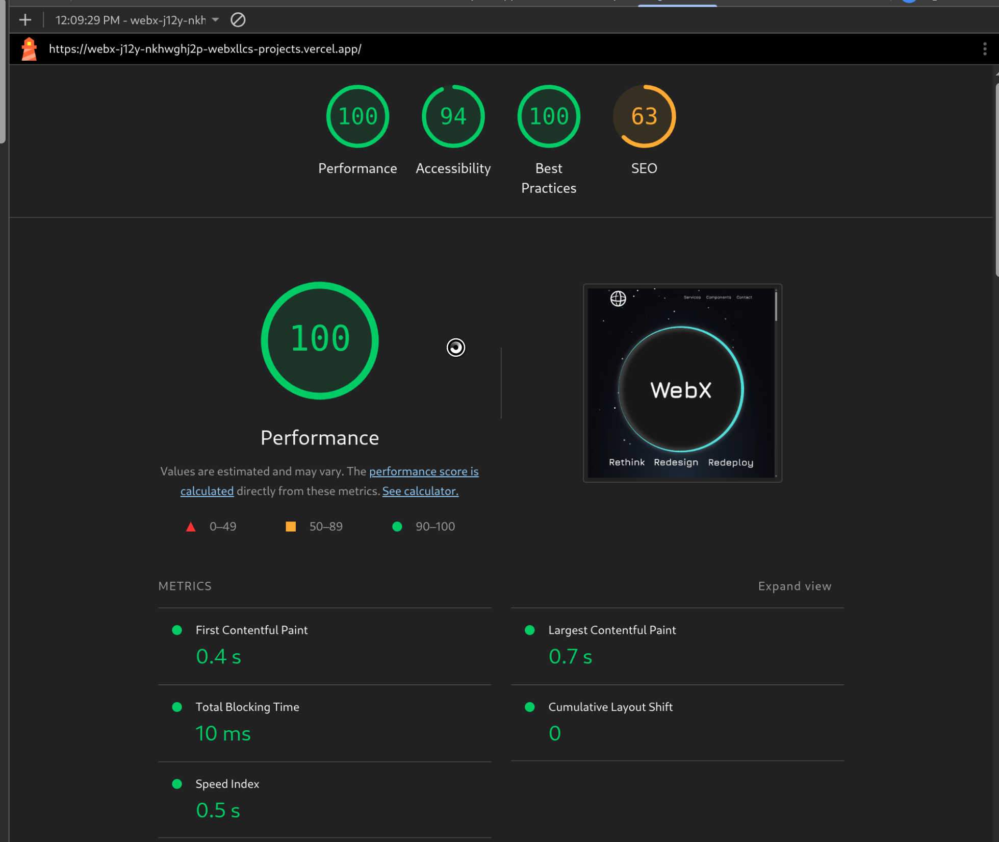

# WebX-Public

## Technical Case Study

This repository documents the **3-year evolution of webx**, my personal
web development platform.

The core project lives in a private repository. This public repo
highlights architecture decisions, performance optimizations,
and engineering challenges.

## What This Repo Demonstrates

- modern frontend architecture
- performance optimization
- SEO strategy
- animation systems
- long-term project evolution

## Overview

**webx** is a personal development platform used to experiment with
modern frontend architecture, performance optimization, and SEO.

The project evolved from a beginner static site into a
performance-focused **Next.js application**.

## Documentation

Detailed technical breakdowns:

- [Architecture](docs/architecture.md)
- [Engineering Challenges](docs/engineering-challenges.md)
- [Performance Strategy](docs/performance.md)

## Versions

| Version | Status | Source / Link | Key Focus |
| :--- | :--- | :--- | :--- |
| **Current** | 🟢 Live | [webx.ink](https://www.webx.ink) | UI & SEO Optimization  |
| **v4.0** | 🟡 Legacy | [Demo Link](https://webx-j12y-nkhwghj2p-webxllcs-projects.vercel.app/) | 1234 |
| **v3.0** | ⚪ Archive | [Source Code](https://github.com/blaxtonj/webx/tree/3d27fc6cc842c7025aadf3e7dd479bbdf74fc8d3) | 1234 |
| **v2.0** | ⚪ Archive | [Source Code](https://github.com/blaxtonj/webx/tree/9abb46622cd85e1bf3f2ef755bd855a586e3e9e2) | 1234 |
| **v1.0** | ⚪ Archive | [Source Code](https://github.com/blaxtonj/webx/tree/9abb46622cd85e1bf3f2ef755bd855a586e3e9e2) | 1234 |

## Tech Stack

| Category | Tools & Technologies |
| :--- | :--- |
| **Framework** | React, Next.js, TypeScript |
| **State Management** | Zustand |
| **Styling & UI** | Tailwind CSS|
| **Animation** | Motion (Motion One) |
| **Forms & Validation** | React Hook Form, Yup |
| **Backend Utilities** | Node.js, Nodemailer |
| **Deployment & Ops** | GitHub, Vercel |
| **Tooling** | ESLint, Prettier |
| **Analytics** | Google Analytics (GA4) |

## Lighthouse Performance

Current

Legacy (v4)

